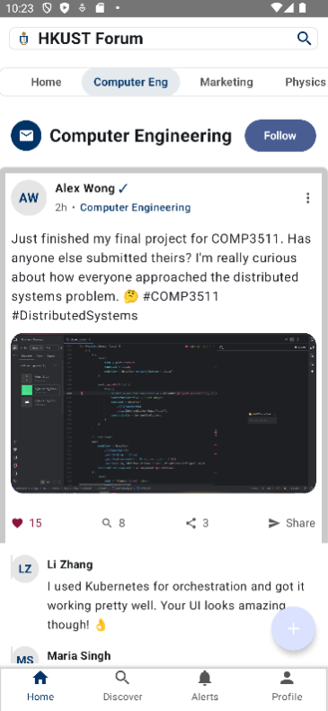
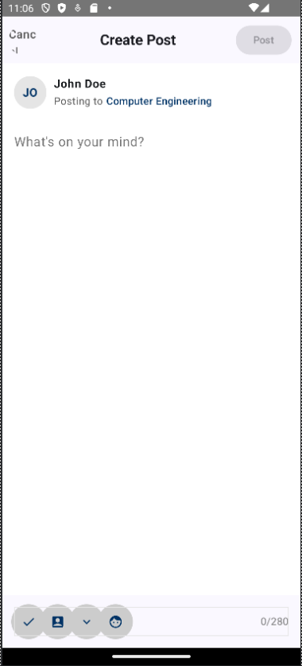

📱 HKUST Forum App
HKUST Forum is a mobile application designed for students of the Hong Kong University of Science and Technology (HKUST) to share, discuss, and interact through campus-related posts. The app features a category-based forum, post creation, like functionality, and real-time search and filtering.

 
Built with:

Android using Kotlin & Jetpack Compose

Spring Boot backend with RESTful API and JWT authentication

MySQL database with Spring Data JPA

🔍 Features
🔐 Secure login and registration

📝 Create, view, and like posts

🗂️ Filter posts by category or tag

📈 Discover trending topics

📲 Modern UI with Compose Material 3

